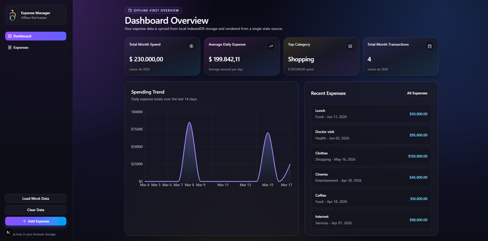
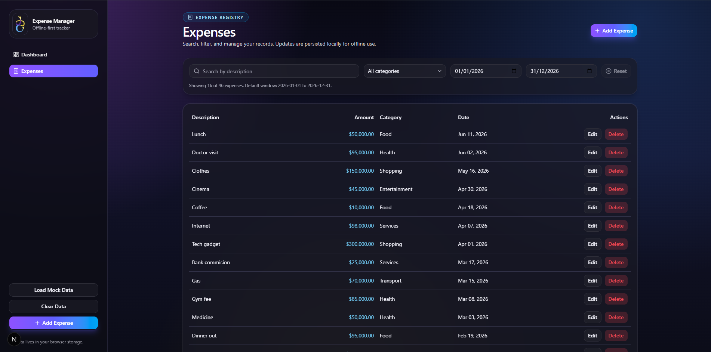
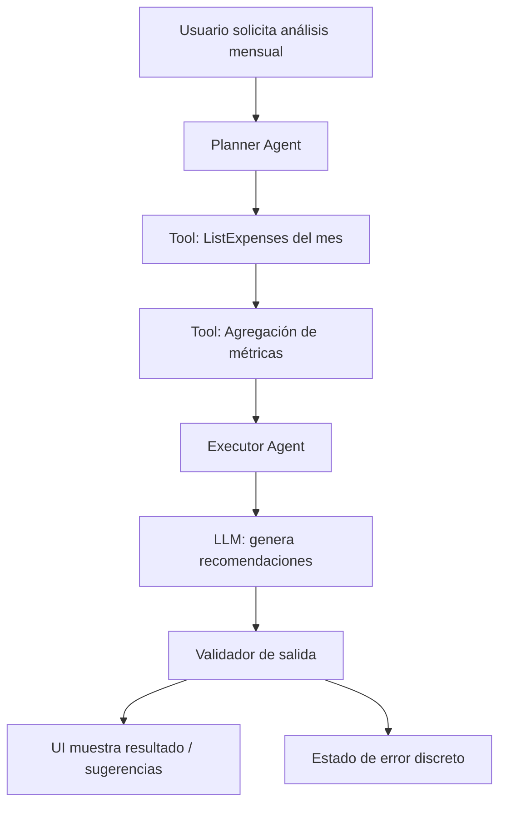

# Expense Manager - Prueba Técnica Frontend (Next.js)

Este repositorio corresponde a una **prueba técnica para Omnicon** para el rol de **Frontend Developer**.
La aplicación es un gestor de gastos **offline-first**, construido con **Next.js** y componentes de **shadcn/ui**, siguiendo una organización inspirada en **arquitectura hexagonal**.

## Objetivo del proyecto

Construir una app web para registrar y consultar gastos, con foco en:

- experiencia de usuario moderna (desktop + mobile),
- persistencia local (IndexedDB),
- separación de responsabilidades por capas,
- escalabilidad para futuras integraciones (por ejemplo AI).

## Stack principal

- Next.js (App Router)
- React + TypeScript
- Zustand (estado)
- shadcn/ui + Tailwind CSS
- IndexedDB (persistencia local)
- Recharts (gráficas)

## Funcionalidades implementadas

- Dashboard con métricas reales y gráfica de tendencia de gasto.
- Página de Expenses con tabla y operaciones CRUD.
- Filtros por:
  - categoría,
  - rango de fechas,
  - búsqueda por descripción.
- Filtro por defecto del año actual.
- Orden por fecha descendente (más recientes primero).
- Paginación de 20 resultados por página.
- Navbar responsive con menú móvil para navegación y acciones.
- Confirmación visual de borrado con toast (en vez de `confirm`).

## Estructura de arquitectura (resumen)

- `lib/domain`: entidades, contratos y reglas base.
- `lib/application/use-cases`: casos de uso de negocio.
- `lib/infrastructure`: implementación de repositorio (IndexedDB).
- `store`: estado global y composición de casos de uso.
- `components`: UI desacoplada de infraestructura.

## Ejecución local

```bash
npm install
npm run dev
```

Abrir: `http://localhost:3000`

Validación:

```bash
npm run lint
npm run build
```

## Capturas

Puedes reemplazar estas imágenes con screenshots reales de la app:

- `docs/images/dashboard-preview.svg`
- `docs/images/expenses-preview.svg`




---

## Potencial integración de AI

En un escenario donde se requiera agregar capacidades de inteligencia artificial (por ejemplo: categorización automática de gastos, asistente financiero, etc.), el enfoque sería:

### 1) ¿Cómo diseñaría el workflow de AI? ¿Qué patrón agentic implementaría?

Para integrar inteligencia artificial en la aplicación, pensaría en un flujo basado en agentes que puedan analizar la información del usuario y tomar decisiones apoyándose en herramientas. Por ejemplo, un agente podría recibir una solicitud como “analizar mis gastos del mes” y a partir de ahí consultar los datos guardados, procesarlos y luego usar un modelo de lenguaje para generar recomendaciones. El patrón que usaría sería algo tipo planner + executor, donde el agente decide qué acciones tomar (consultar gastos, calcular totales, llamar al modelo, etc.) y ejecuta cada paso de forma controlada.

### 2) ¿Cómo integraría esta funcionalidad en la arquitectura existente del proyecto?

En cuanto a la integración con la arquitectura actual, la idea es mantener la separación de responsabilidades que ya existe. El agente no accedería directamente a la base de datos, sino que usaría los mismos casos de uso (create, update, list, etc.) que ya tiene la aplicación. Además, se pueden definir “herramientas” que el agente utilice, como acceso a IndexedDB para leer gastos o servicios externos si se necesita ampliar funcionalidades. De esta forma, el sistema sigue siendo escalable y en el futuro sería fácil cambiar de almacenamiento local a una API sin tener que reescribir toda la lógica.

### 3) ¿Qué consideraciones tendría para manejo de estado, errores y latencia de llamadas a LLMs?

Sobre el manejo de estado, errores y latencia, es clave darle feedback al usuario mientras el agente está trabajando, ya que las llamadas a modelos pueden tardar. Se puede manejar un estado de carga con pasos intermedios (por ejemplo: analizando datos, generando recomendaciones, etc.) y permitir cancelar la operación si es necesario. También es importante manejar errores de forma controlada (por ejemplo, si falla la llamada al modelo o hay límites de uso) y limitar el consumo para evitar costos innecesarios, usando contextos más pequeños o desactivando herramientas más pesadas cuando no sean necesarias.

## Diagrama: Agentic AI Workflow

Feature ejemplo: **"Analizar mis gastos del mes y sugerir optimizaciones"**.


